# Root-Android-Emulator

<p align="center">
  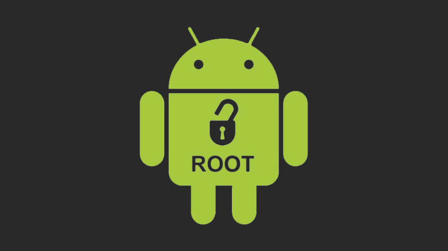
</p>

# Table of Contents
1. [Example Problem Scenario](#example-problem-scenario)

2. [Getting Android Studio](#getting-android-studio)

3. [Setting up your emulator in Android Studio](#setting-up-your-emulator-in-android-studio)

4. [The MacOS journey](#the-macos-journey)

    4.1 [Mac: Installing SuperUser App and Binary](#mac-installing-superuser-app-and-binary)

    4.2 [Mac: Enabling Root](#mac-enabling-root)

    4.3 [(Optional) Mac: Confirming Root has worked](#optional-mac-confirming-root-has-worked)

5. [The Windows Journey](#the-windows-journey)

    5.1 [Win: Installing SuperUser App and Binary](#win-installing-superuser-app-and-binary)

    5.2 [Win: Enabling Root](#win-enabling-root)

    5.3 [(Optional) Win: Confirming Root has worked](#optional-win-confirming-root-has-worked)

6. [A note on different architectures](#a-note-on-different-architectures)

7. [A note on variables](#a-note-on-variables)

8. [TLDR: Commands for MacOS](#tldr-commands-for-macos)

9. [TLDR: Commands for Windows](#tldr-commands-for-windows)

If you find yourself in need of testing something on a "rooted" android device and can't get a physical device to root then you can always use the Android Emulator through Android Studio.

Rooting is simply the act of allowing the user to execute commands on the device at the highest level of permissions. These are usually locked out of consumer devices but sometimes you need that level of access for devlopment, software testing or simply to experiment with something.

This guide will take you through rooting an Android Emulator so you can have full access to it and is inteded for educational purposes only.

> _If you should encounter any strange bugs during this process or any error messages not mentioned - I encourage you to copy the error message into Google as this will usually offer a solution through resources such as Stack Overflow or Reddit_

## Example Problem Scenario

> _I want to have root access to a Nexus 5X running Android 7.1_

This is a very specific scenario, however it is something that Software Testers and Developers have come across before. Through this example we'll use this repo to solve that scenario.

## Getting Android Studio
- Firstly we need Android Studio; go [here](https://www.examplhttps://developer.android.com/studio?gclid=EAIaIQobChMI49mm35i29wIVGoBQBh3f5gKGEAAYASAAEgJEJPD_BwE&gclsrc=aw.ds#downloadse.com) and download the version of Android Studio you need depending on your operating system.

## Setting up your emulator in Android Studio
- Open Android Studio
- Create a new Project (the exact details don't really matter)
- Navigate to Tools > SDK Manager
- On the next screen you'll see a list of different Android operating systems
- From this List, click the tick box labelled "Show Package Detils" in the lower right corner

<p align="center">
  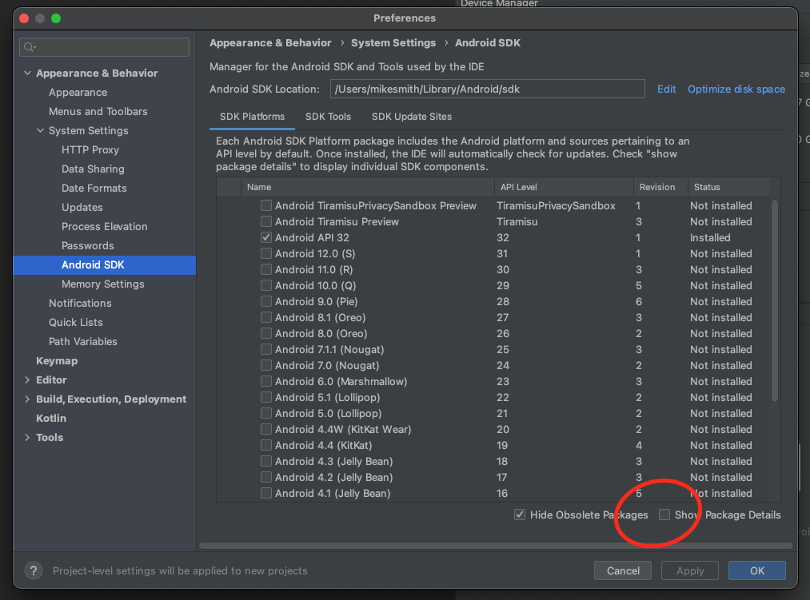
</p>

- Scroll to the Android 7.1 section
- Here you'll find a lot of different types of System Images. For maxiumum compatibility choose "Google APIs Intel x86 Atom_64 System Image"

> _It's important to note at this stage that with the Google API versions of system images, you won't be able to access the Play Store so ensure you have a copy of any .apk files you want to install_
- Tick the tickbox next to the "Google APIs Intel x86 Atom_64 System Image"

<p align="center">
  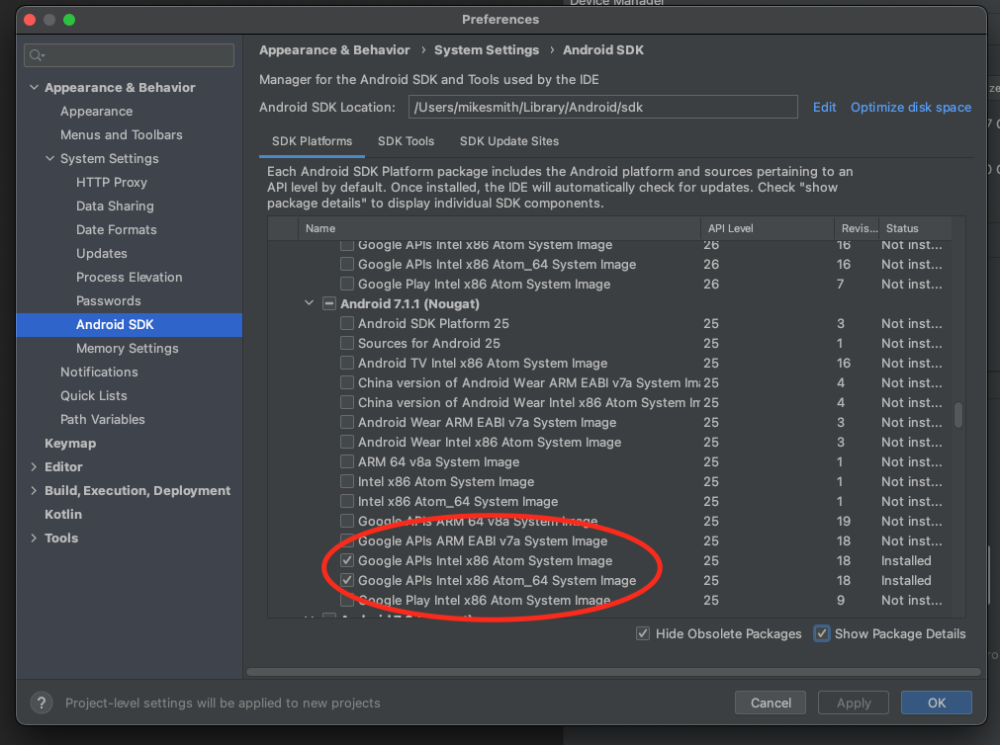
</p>

- Click Apply
> _This will install the system image and might take a few minutes_
- Once finished, click Finish then OK to go back to the main Android Studio window
- Click 'Create Device' in the Device Manager section of Android Studio > If this isn't visable, you can find this by choosing the View > Tool Windows > Device Manager option
- On the Select Hardware window, choose Nexus 5
<p align="center">
  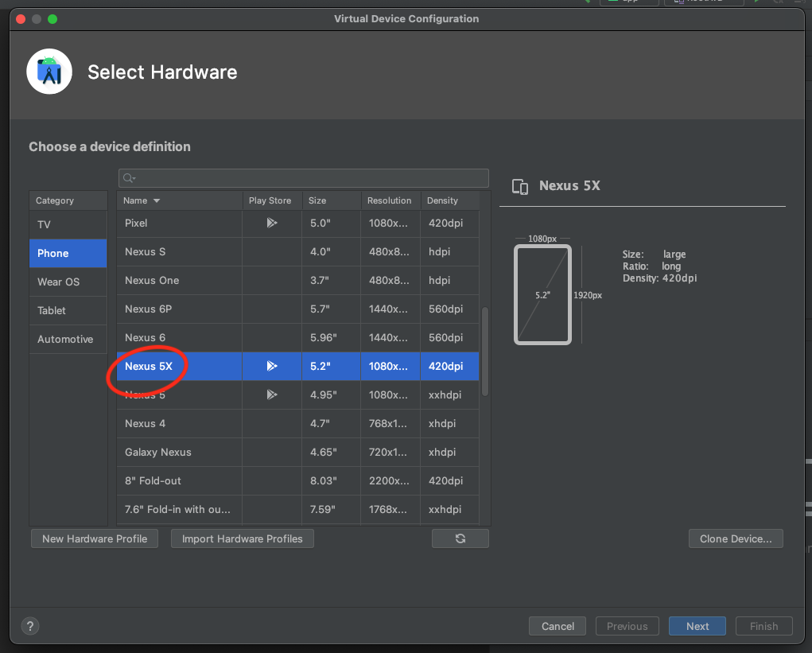
</p>
- Click Next
- On the Select Image window, click the "x86 Images' near the top of the screen, this will give you more images to select from
- From this new list, find and choose Nougat, API Level 25, ABI x86_64 Target Android 7.1.1 (Google APIs)
<p align="center">
  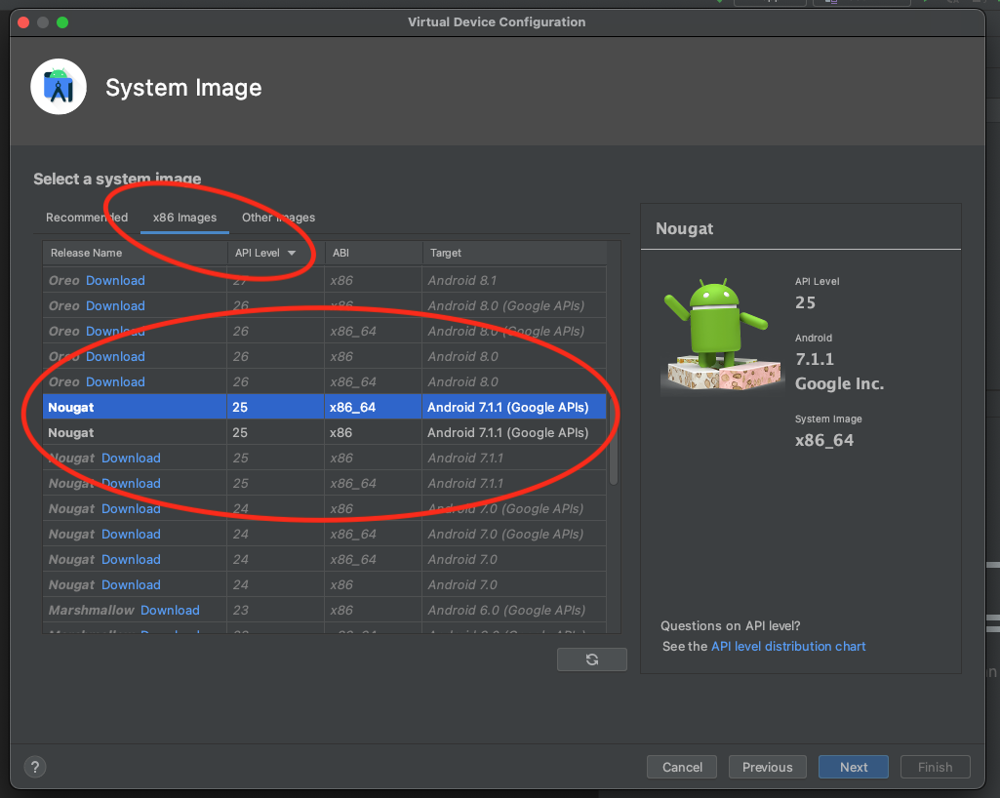
</p>
- Click next 
- Name you Android Virtual Device (AVD) RootAVD for the purposes of this demo
<p align="center">
  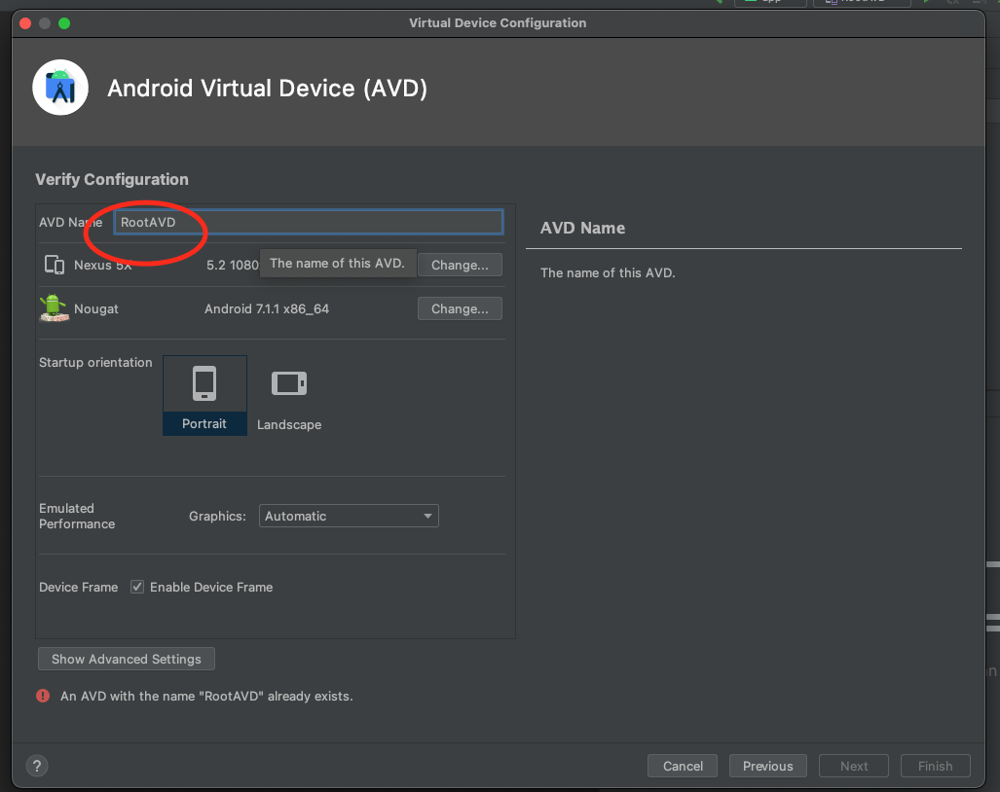
</p>
- Click Finish


# The MacOS journey
## Mac: Installing SuperUser App and Binary 

- Run the command 
```
~/Library/Android/sdk/emulator/emulator -avd RootAVD -writable-system -selinux disabled -qemu
```
> _This will start your emulator from the command line and make the device writeable for the next steps, you will see output similar to the following)_

<p align="center">
  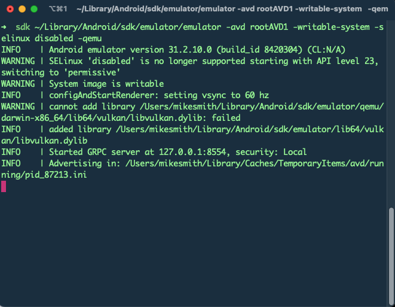
</p>

- Open a new Terminal window or tab <u>**(Do not close the original one)**</u>
- Make sure your terminal is in the correct directory by running 
```
cd /Users/<yourusername>/Library/Android/sdk/platform-tools
```
- Still on the Terminal and in the `platform-tools` folder, run 
```
./adb root
```
_> You should see the response `restarting adbd as root`_ 
- In the same Terminal Window, run 
```
./adb remount
```
_> You should see the response `remount succeeded`_ 
- At this stage, download the files in this repo (usually by clicking the dropdown arrow next to Code near the top of this GitHub page) save the files as a .zip
Extract the .zip to your Desktop, you should end up with a folder called 'SuperSU' on your Desktop
- Back in the Terminal, run the command 
```
./adb install ~/Desktop/SuperSU/common/Superuser.apk
```
> _This has installed the 'SuperUser' application onto your emulated device_
- You should see a response similar to `Performing Streamed Install - Success`
- In the same Terminal window, run the command 
```
./adb push ~/Desktop/SuperSU/x86/su /system/xbin/su
``` 
> _This command will move a file from the downloaded files to your device that is needed for rooting the device. It's a binary file for the SuperUser app, there are several different versions of this based on the architecture of your system / application but I'll get into those shortly_

- You should receive a response that includes something similar to `(253796 bytes in 0.107s)` which means it's worked 
- In the same Terminal window - run the command 
```
./adb shell chmod 0755 /system/xbin/su
```
> _This changes the inherent permissions of the 'su' file we just moved so we can run it, different chmod numbers do different things so if you need something different, please Google the exact number you need)_

- You won't get a response from this command but that usually means it's worked. No error message means progress in this case. 
- In the Terminal, run 
```
./adb shell setenforce 0
``` 
> _This will change the enforcement policy so we can install the binary we need_

- You probably won't get a response from this command either, don't worry about it. 
- From the Terminal, run 
```
./adb shell su --install
``` 
> _This installs the binary we just moved to work with the SuperUser app_

- Again, no response from the Terminal, totally normal. 
- Finally in this stage, from the Terminal run the command 
```
./adb shell su --daemon& 
```
> _This will allow the SuperUser app to run_
- This command will give you a response, usually a number similar to the format of `[1] 87611`  


## Mac: Enabling Root
- On your emulated device, find and open the SuperSU app. 

<p align="center">
  
</p>

- You should see a message saying that the Binary needs updating
<p align="center">
  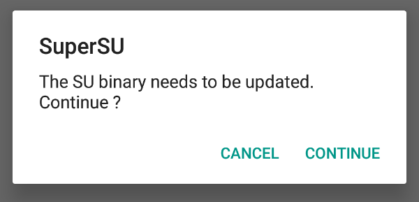
</p>
- Click Continue
- On the next window, choose Normal
<p align="center">
  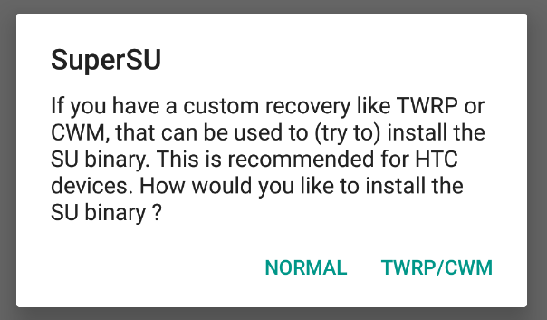
</p>
- You should now see an 'installing' dialog box...
<p align="center">
  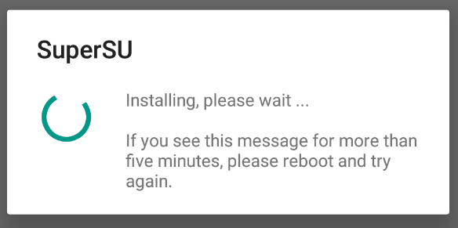
</p>
- Eventually, however, you should see an 'installation failed' prompt. This is totally normal.
<p align="center">
  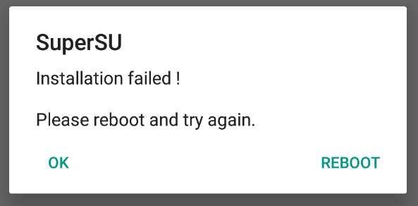
</p>
- Click OK

---


## (Optional) Mac: Confirming Root has worked
At this stage you have rooted your Android Enulator, however I always like to perform the following steps to make sure it's actually happened.

- From your Teminal window, run the command 
```
./adb install ~/Desktop/SuperSU/common/Terminal.apk
``` 
> _You should see a response similar to `Performing Streamed Install - Success`_
- On your emulated device, open the newly installed "Terminal Emulator" app
<p align="center">
  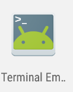
</p>
- On this terminal emulator, simply type in `su` and then press return.

- The following dialog popup will ask you if SuperSU should grant root access to this application, press Grant
<p align="center">
  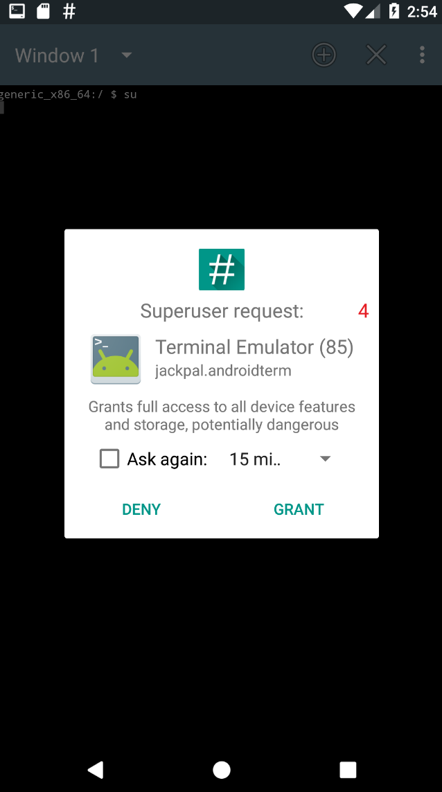
</p>
- If your terminal line now resembles `generic_x86_64:/ #` then **congratulations**, the rooting has worked. If it did not work you would reveive an error at this stage similar to `invalid command`
<p align="center">
  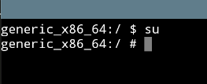
</p>

# The Windows Journey
## Win: Installing SuperUser App and Binary 

- Open Command Prompt (CMD) <u>**as an Administrator**</u>
- Run the command 
```
C:\Users\<username>\AppData\Local\Android\Sdk\emulator\emulator -avd RootAVD -writable-system -selinux disabled -qemu
```
> _This will start your emulator from the command line and make it writeable for the next steps_
- Open a new Command Prompt window or tab <u>**as an Administrator**</u>  (Do not close the original one)
- Make sure your Command Prompt is in the correct directory by running 
```
cd C:\Users\<username>\AppData\Local\Android\Sdk\platform-tools
```
- Still on the Command Prompt and in the `platform-tools` folder, run 
```
adb root
```
- You should see the response `restarting adbd as root`
- In the same Command Prompt Window, run 
```
adb remount
```
- You should see the response `remount succeeded`
- At this stage, download the files in this repo (usually by clicking the dropdown arrow next to Code near the top of this GitHub page) save the files as a .zip
Extract the .zip to your Desktop, you should end up with a folder called 'SuperSU' on your Desktop
- Back in the Terminal, run the command 
```
adb install C:\Users\<username>\Desktop\SuperSU\common\Superuser.apk
```
> _this has installed the 'SuperUser' application onto your emulated device_
- You should see a response similar to `Performing Streamed Install - Success`
- In the same Command Prompt window, run the command 
```
adb push C:\Users\<username>\Desktop\SuperSU\x86\su /system/xbin/su
``` 
- You should receive a response that includes something similar to `(253796 bytes in 0.107s)` which means it's worked 
> _This command will move a file from the downloaded files to your device that is needed for rooting the device. It's a binary file for the SuperUser app, there are several different versions of this based on the architecture of your system / application but I'll get into those shortly_

> **Very important to remember that there are different direction slashes for different operating systems. Windows uses \ but android devices uses / so when interacting with both systems with commands like this make sure that you're using the right slashes in the right places.**
- In the same Command Prompt window - run the command 
```
adb shell chmod 0755 /system/xbin/su
``` 
> _This changes the inherent permissions of the 'su' file we just moved so we can run it, different chmod numbers do different things so if you need something different, please Google the exact number you need)_

- You won't get a response from this command but that usually means it's worked. No error message means progress in this case.  
- In the Command Prompt, run 
```
adb shell setenforce 0
```
> _This will change the enforcement policy so we can install the binary we need_

- You probably won't get a response from this command either, don't worry about it. 
- From the Command Prompt, run 
```
adb shell su --install
```
> _This installs the binary we just moved to work with the SuperUser app_
- Again, no response from the Command Prompt, totally normal. 
- Finally in this stage, from the Command Prompt run the command 
```
adb shell su --daemon&
``` 
> _This will allow the SuperUser app to run_
- This command will give you a response, usually a number similar to the format of `[1] 87611`  

## Win: Enabling Root
- On your emulated device, find and open the SuperSU app. 

<p align="center">
  
</p>

- You should see a message saying that the Binary needs updating
<p align="center">
  
</p>
- Click Continue
- On the next window, choose Normal
<p align="center">
  
</p>
- You should now see an 'installing' dialog box...
<p align="center">
  
</p>
- Eventually, however, you should see an 'installation failed' prompt. This is totally normal.
<p align="center">
  
</p>
- Click OK

## (Optional) Win: Confirming Root has worked
At this stage you have rooted your Android Enulator, however I always like to perform the following steps to make sure it's actually happened.

- From your Teminal window, run the command 
```
adb install C:\Users\<username>\Desktop\SuperSU/common/Terminal.apk
``` 
> _You should see a response similar to `Performing Streamed Install - Success`_
- On your emulated device, open the newly installed "Terminal Emulator" app
<p align="center">
  
</p>
- On this terminal emulator, simply type in `su` and then press return.

- The following dialog popup will ask you if SuperSU should grant root access to this application, press Grant
<p align="center">
  
</p>
- If your terminal line now resembles `generic_x86_64:/ #` then **congratulations**, the rooting has worked. If it did not work you would reveive an error at this stage similar to `invalid command`
<p align="center">
  
</p>

### A note on different architectures
As mentioned previously; there are several different architecture configurations for different devices (arm, arm64, armv7, x64, x86 and more)  In the files of this project you'll find similar files for those architectures. Simply change the `x86` to your desired architecture in the `./adb push ~/Desktop/SuperSU/x86/su /system/xbin/su` command

### A note on variables
You can make this a bit easier by using variables in the path. For example on Windows you could have `C:\Users\<username>\AppData\Local\Android\Sdk` saved as the variable SDK_PATH so you would only need to type in `%SDK_PATH%\emulator` for example

To set a variable on Windows run the command "set VARNAME=VARVAULE" so for this example I'd type `set SDK_PATH=C:\Users\<username>\AppData\Local\Android\Sdk`

I could then check this has worked by using the echo command with `echo %SDK_PATH%` which should print out the full file directlry that I saved

To set a veriable on MacOS run the command "export VARNAME=VARVALUE" so in this example I'd type `export SDK_PATH=/users/<username>/Library/Android/sdk`

I could then ensure that's worked by using the echo command with `echo $SDK_PATH` which should print out the full file directory that I saved.
### TLDR: Commands for MacOS
```
~/Library/Android/sdk/emulator/emulator -avd RootAVD -writable-system -selinux disabled -qemu
cd /Users/<yourusername>/Library/Android/sdk/platform-tools
./adb root
./adb remount
./adb install ~/Desktop/SuperSU/common/Superuser.apk
./adb push ~/Desktop/SuperSU/x86/su /system/xbin/su
./adb shell chmod 0755 /system/xbin/su
./adb shell setenforce 0
./adb shell su --install
./adb shell su --daemon&
Open SuperSU on the device
You're done!
```
### TLDR: Commands for Windows
```
C:\Users\<username>\AppData\Local\Android\Sdk\emulator\emulator -avd RootAVD -writable-system -selinux disabled -qemu
cd C:\Users\<username>\AppData\Local\Android\Sdk\platform-tools
adb root
adb remount
adb install C:\Users\<username>\Desktop\SuperSU\common\Superuser.apk
adb push C:\Users\<username>\Desktop\SuperSU\x86\su /system/xbin/su
adb shell chmod 0755 /system/xbin/su
adb shell setenforce 0
adb shell su --install
adb shell su --daemon&
Open SuperSU on the device
You're done!
```
##### Sources: Modified and expanded from a project by [0xFireball](https://github.com/0xFireball/root_avd)